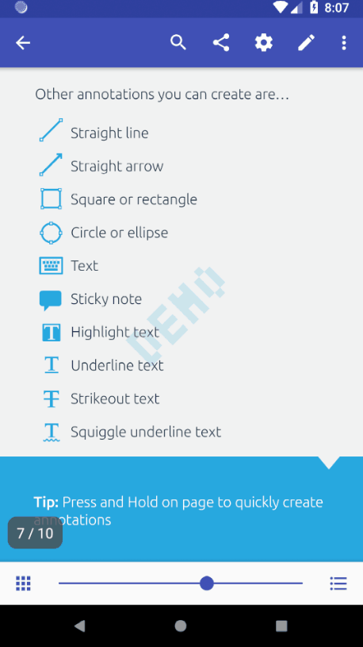

# react-native-pdftron

- [System requirements](#system-requirements)
- [Preview](#preview)
- [Installation](#installation)
- [Usage](#usage)
- [Components](#components)
- [License](#license)

## System requirements
- npm
- PDFTron SDK >= 6.8.0
- react-native >= 0.49.3

## Preview

### Android


### iOS


## Installation

### Android

1. First, follow the official getting started guide on [setting up React Native environment](https://facebook.github.io/react-native/docs/getting-started.html#the-react-native-cli-1), [setting up Android environment](https://facebook.github.io/react-native/docs/getting-started.html#android-development-environment), and [create a React Native project](https://facebook.github.io/react-native/docs/getting-started.html#creating-a-new-application-1), the following steps will assume your package ID is `com.myapp` (i.e. through `react-native init MyApp`)
2. In `MyApp` folder, install `react-native-pdftron` with `npm install git+https://github.com/PDFTron/pdftron-react-native.git --save`
2. Copy this folder into your node modules folder,
3. Link the module `react-native link react-native-pdftron`
4. In your root `android/build.gradle`:

```diff
buildscript {
    repositories {
        jcenter()
+       google()
    }
    dependencies {
-       classpath 'com.android.tools.build:gradle:2.2.3'
+       classpath 'com.android.tools.build:gradle:3.1.2'

        // NOTE: Do not place your application dependencies here; they belong
        // in the individual module build.gradle files
    }
}

allprojects {
    repositories {
        mavenLocal()
        jcenter()
        maven {
            // All of React Native (JS, Obj-C sources, Android binaries) is installed from npm
            url "$rootDir/../node_modules/react-native/android"
        }
+       google()
+       maven {
+           url "s3://pdftron-maven/release"
+           credentials(AwsCredentials) {
+               accessKey AWS_ACCESS_KEY
+               secretKey AWS_SECRET_KEY
+           }
+       }
    }
}
```

5. If you have not requested a trial, [obtain your license key here](https://www.pdftron.com/documentation/android/guides/getting-started/integrate-gradle/), then in your root `android/gradle.properties`:

```diff
+AWS_ACCESS_KEY=YOUR_AWS_ACCESS_KEY
+AWS_SECRET_KEY=YOUR_AWS_SECRET_KEY
+PDFTRON_LICENSE_KEY=YOUR_PDFTRON_LICENSE_KEY_GOES_HERE
```

6. Update gradle version in `android/gradle/wrapper/gradle-wrapper.properties`:

```diff
-distributionUrl=https\://services.gradle.org/distributions/gradle-2.14.1-all.zip
+distributionUrl=https\://services.gradle.org/distributions/gradle-4.4-all.zip
```

7. In your `android/app/build.gradle`:

```diff
android {
-   compileSdkVersion 23
-   buildToolsVersion "23.0.1"
+   compileSdkVersion 27
+   buildToolsVersion "27.0.3"

    defaultConfig {
        applicationId "com.myapp"
        minSdkVersion 16
-       targetSdkVersion 22
+       targetSdkVersion 27
        versionCode 1
        versionName "1.0"
        ndk {
            abiFilters "armeabi-v7a", "x86"
        }
+       multiDexEnabled true
+       manifestPlaceholders = [pdftronLicenseKey:PDFTRON_LICENSE_KEY]
    }
+   configurations.all {
+       resolutionStrategy.force "com.android.support:appcompat-v7:27.0.2"
+       resolutionStrategy.force "com.android.support:support-v4:27.0.2"
+   }
}
```

8. Add license key placeholder to your `android/app/src/main/AndroidManifest.xml` file:

```diff
<manifest xmlns:android="http://schemas.android.com/apk/res/android"
    package="com.myapp">
+ <uses-permission android:name="android.permission.WRITE_EXTERNAL_STORAGE" />

  <application
    ...
+   android:largeHeap="true">

+   <meta-data
+     android:name="pdftron_license_key"
+     android:value="${pdftronLicenseKey}"/>

    <activity
      android:name=".MainActivity"
      android:label="@string/app_name"
      android:configChanges="keyboard|keyboardHidden|orientation|screenSize"
-     android:windowSoftInputMode="adjustResize"
+     android:windowSoftInputMode="adjustPan"
+     android:theme="@style/CustomAppTheme">
      <intent-filter>
          <action android:name="android.intent.action.MAIN" />
          <category android:name="android.intent.category.LAUNCHER" />
      </intent-filter>
    </activity>
    <activity android:name="com.facebook.react.devsupport.DevSettingsActivity" />

+   <provider
+       android:name="android.support.v4.content.FileProvider"
+       android:authorities="${applicationId}.provider"
+       android:exported="false"
+       android:grantUriPermissions="true">
+       <meta-data
+           android:name="android.support.FILE_PROVIDER_PATHS"
+           android:resource="@xml/provider_paths" />
+   </provider>
  </application>
</manifest>
```

9. Define Activity theme in `android/app/src/main/res/values/styles.xml`:

```diff
<resources>
+   <style name="CustomAppTheme" parent="Theme.AppCompat.DayNight.NoActionBar">
+       <item name="colorPrimary">@color/app_color_primary_day</item>
+       <item name="colorPrimaryDark">@color/app_color_primary_dark_day</item>
+       <item name="colorAccent">@color/app_color_accent</item>
+       <!-- Action bar -->
+       <item name="actionModeBackground">?attr/colorPrimary</item>
+       <item name="windowActionModeOverlay">true</item>
+   </style>
</resources>
```

10. Use `ReactCompatActivity` instead of `ReactActivity` in `android/app/src/main/java/com/myapp/MainActivity.java` to make good use of the support library:

```diff
-import com.facebook.react.ReactActivity;
+import com.facebook.react.ReactCompatActivity;

-public class MainActivity extends ReactActivity {
+public class MainActivity extends ReactCompatActivity {
  ...
}
```

11. Create a `android/app/src/main/res/raw` folder and add a sample file to it, i.e. `sample.pdf`
12. Lastly, replace `App.js` with what is shown [here](#usage)
13. In root directory, run `react-native run-android`

### iOS

1. First, follow the official getting started guide on [setting up React Native environment](https://facebook.github.io/react-native/docs/getting-started.html#the-react-native-cli-1), [setting up iOS environment](https://facebook.github.io/react-native/docs/getting-started.html#xcode), and [create a React Native project](https://facebook.github.io/react-native/docs/getting-started.html#creating-a-new-application-1), the following steps will assume your app is created through `react-native init MyApp`)
2. In `MyApp` folder, install `react-native-pdftron` with `npm install git+https://github.com/PDFTron/pdftron-react-native.git --save`
3. Link the module `react-native link react-native-pdftron`
4. Add a `Podfile` in the `ios` folder with the following:

```
target 'MyApp' do
    use_frameworks!
    pod 'PDFNet', podspec: 'POD_LINK_GOES_HERE'
end
```

5. In `ios` folder, run `pod install`
6. Open `MyApp.xcworkspace` in Xcode and add a test file to `MyApp`, i.e. `sample.pdf`
7. If you need a close button icon, you will need to add the png resources to `MyApp` as well, i.e. `ic_close_black_24px`
8. Try building `MyApp`, if any error occurs, change project setting as described here: https://github.com/facebook/react-native/issues/7308#issuecomment-230198331
9. Lastly, replace `App.js` with what is shown [here](#usage)

## Usage

In `App.js`:

```javascript
import React, { Component } from 'react';
import {
  Platform,
  StyleSheet,
  Text,
  View,
  PermissionsAndroid,
  BackHandler,
  NativeModules,
  Alert
} from 'react-native';

import { DocumentView } from 'react-native-pdftron';
const RNPdftron = NativeModules.RNPdftron;

type Props = {};
export default class App extends Component<Props> {

  constructor(props) {
    super(props);

    this.state = {
      permissionGranted: Platform.OS === 'ios' ? true : false
    };

    RNPdftron.initialize("your_pdftron_license_key");
  }

  componentDidMount() {
    if (Platform.OS === 'android') {
      this.requestStoragePermission();
    }
  }

  async requestStoragePermission() {
    try {
      const granted = await PermissionsAndroid.request(
        PermissionsAndroid.PERMISSIONS.WRITE_EXTERNAL_STORAGE
      );
      if (granted === PermissionsAndroid.RESULTS.GRANTED) {
        this.setState({
          permissionGranted: true
        });
        console.log("Storage permission granted");
      } else {
        this.setState({
          permissionGranted: false
        });
        console.log("Storage permission denied");
      }
    } catch (err) {
      console.warn(err);
    }
  }

  onLeadingNavButtonPressed = () => {
    console.log('leading nav button pressed');
    if (Platform.OS === 'ios') {
      Alert.alert(
        'App',
        'onLeadingNavButtonPressed',
        [
          {text: 'OK', onPress: () => console.log('OK Pressed')},
        ],
        { cancelable: true }
      )
    } else {
      BackHandler.exitApp();
    }
  }

  render() {
    if (!this.state.permissionGranted) {
      return (
        <View style={styles.container}>
          <Text>
            Storage permission required.
          </Text>
        </View>
      )
    }

    const path = Platform.OS === 'ios' ? "sample" : "android.resource://com.myapp/raw/sample.pdf";

    return (
      <DocumentView
        document={path}
        showLeadingNavButton={true}
        leadingNavButtonIcon={Platform.OS === 'ios' ? 'ic_close_black_24px.png' : 'ic_arrow_back_white_24dp'}
        onLeadingNavButtonPressed={this.onLeadingNavButtonPressed}
      />
    );
  }
}

const styles = StyleSheet.create({
  container: {
    flex: 1,
    justifyContent: 'center',
    alignItems: 'center',
    backgroundColor: '#F5FCFF',
  }
});
```

- (iOS) For app bundle file path:

```javascript
document="sample"
```

- (Android) For local storage file path:

```javascript
document="file:///storage/emulated/0/Download/sample.pdf"
```

- (Android) For raw resource path (include file extension):

```javascript
document="android.resource://mypackagename/raw/sample.pdf"
```

- (Android) For content Uri:

```javascript
document="content://..."
```

## Components

### DocumentView

A component for displaying documents of different types such as PDF, docx, pptx, xlsx and various image formats.

#### Props
- [document](#document)
- [password](#password)
- [leadingNavButtonIcon](#leadingnavbuttonicon)
- [onLeadingNavButtonPressed](#onleadingnavbuttonpressed)
- [showLeadingNavButton](#showleadingnavbutton)

##### document
string, required
##### password
string, optional
##### leadingNavButtonIcon
string, optional
##### onLeadingNavButtonPressed
function, optional
##### showLeadingNavButton
bool, optional

## License
See [License](./LICENSE)
