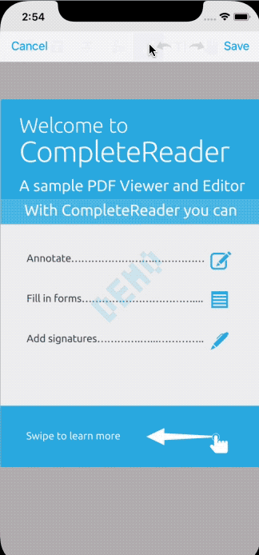

# PDFTron React Native Wrapper

- [Prerequisites](#prerequisites)
- [Preview](#preview)
- [Installation](#installation)
- [Usage](#usage)
- [Components](#components)
- [License](#license)

## Prerequisites
- No license key is required for trial. However, a valid commercial license key is required after trial.
- npm or yarn
- PDFTron SDK >= 6.10.0
- react-native >= 0.60.0 (for versions before 0.60.0, use branch `rn553`)

## Preview

**Android** |  **iOS**
:--:|:--:
 | 

## Installation

0. If using yarn, do: `yarn global add react-native-cli`

1. First, follow the official getting started guide on [setting up the React Native environment](https://reactnative.dev/docs/environment-setup), [setting up the iOS and Android environment](https://reactnative.dev/docs/environment-setup), and [creating a React Native project](https://reactnative.dev/docs/environment-setup), the following steps will assume your app is created through `react-native init MyApp`.

2. In `MyApp` folder, install `react-native-pdftron` by calling:
    ```shell
    yarn add github:PDFTron/pdftron-react-native
    yarn add @react-native-community/cli --dev
    yarn add @react-native-community/cli-platform-android --dev
    yarn add @react-native-community/cli-platform-ios --dev
    yarn install
    ```
    or
    ```shell
    npm install github:PDFTron/pdftron-react-native --save
    npm install @react-native-community/cli --save-dev
    npm install @react-native-community/cli-platform-android --save-dev
    npm install @react-native-community/cli-platform-ios --save-dev
    ```

### Android

1. Add the following in your `android/app/build.gradle` file:

    ```diff
    android {
        compileSdkVersion rootProject.ext.compileSdkVersion

        compileOptions {
            sourceCompatibility JavaVersion.VERSION_1_8
            targetCompatibility JavaVersion.VERSION_1_8
        }

        defaultConfig {
            applicationId "com.reactnativesample"
            minSdkVersion rootProject.ext.minSdkVersion
            targetSdkVersion rootProject.ext.targetSdkVersion
            versionCode 1
            versionName "1.0"
    +       multiDexEnabled true
        }

        dependencies {
    +       implementation "androidx.multidex:multidex:2.0.1"
        }

        ...
    }
    ```

2. Add the following to your `android/build.gradle` file:
	```diff
	buildscript {
	    ext {
		buildToolsVersion = "28.0.3"
	+	minSdkVersion = 21
		compileSdkVersion = 28
		targetSdkVersion = 28
	    }
	    // ...
	}
	```
3. Add the following to your `android/app/src/main/AndroidManifest.xml` file:

    ```diff
    <manifest xmlns:android="http://schemas.android.com/apk/res/android"
        package="com.myapp">
        
		<uses-permission android:name="android.permission.INTERNET" />
		<!-- Required to read and write documents from device storage -->
	+	<uses-permission android:name="android.permission.WRITE_EXTERNAL_STORAGE" />
		<!-- Required if you want to record audio annotations -->
	+	<uses-permission android:name="android.permission.RECORD_AUDIO" />

      <application
        ...
    +   android:largeHeap="true"
    +   android:usesCleartextTraffic="true">

        <activity
          android:name=".MainActivity"
          android:label="@string/app_name"
          android:configChanges="keyboard|keyboardHidden|orientation|screenSize"
    -     android:windowSoftInputMode="adjustResize"
    +     android:windowSoftInputMode="adjustPan"
    +     android:theme="@style/CustomAppTheme">
          <intent-filter>
              <action android:name="android.intent.action.MAIN" />
              <category android:name="android.intent.category.LAUNCHER" />
          </intent-filter>
        </activity>
        <activity android:name="com.facebook.react.devsupport.DevSettingsActivity" />
      </application>
    </manifest>
    ```

4. In your `android\app\src\main\java\com\myapp\MainApplication.java` file, change `Application` to `MultiDexApplication`:
    ```diff
    - import android.app.Application;
    + import androidx.multidex.MultiDexApplication;
    ...
    - public class MainApplication extends Application implements ReactApplication {
    + public class MainApplication extends MultiDexApplication implements ReactApplication {
    ```

5. Replace `App.js` with what is shown [here](#usage)
6. Finally in the root project directory, run `react-native run-android`.

### iOS

1. Open `Podfile` in the `ios` folder, add:

    ```
    target 'MyApp' do
        use_frameworks!
        pod 'PDFNet', podspec: 'https://www.pdftron.com/downloads/ios/cocoapods/pdfnet/latest.podspec'
        pod 'RNPdftron', :path => '../node_modules/react-native-pdftron'
    end
    ```

2. In the `ios` folder, run `pod install`.
3. (Optional) If you need a close button icon, you will need to add the PNG resources to `MyApp` as well, i.e. `ic_close_black_24px`.
4. Replace `App.js` with what is shown [here](#usage).
5. Finally in the root project directory, run `react-native run-ios`.

## Usage

Replace `App.js` with the following:

```javascript
import React, { Component } from 'react';
import {
  Platform,
  StyleSheet,
  Text,
  View,
  PermissionsAndroid,
  BackHandler,
  NativeModules,
  Alert
} from 'react-native';

import { DocumentView, RNPdftron } from 'react-native-pdftron';

type Props = {};
export default class App extends Component<Props> {

  constructor(props) {
    super(props);

    this.state = {
      permissionGranted: Platform.OS === 'ios' ? true : false
    };

    RNPdftron.initialize("Insert commercial license key here after purchase");
    RNPdftron.enableJavaScript(true);
  }

  componentDidMount() {
    if (Platform.OS === 'android') {
      this.requestStoragePermission();
    }
  }

  async requestStoragePermission() {
    try {
      const granted = await PermissionsAndroid.request(
        PermissionsAndroid.PERMISSIONS.WRITE_EXTERNAL_STORAGE
      );
      if (granted === PermissionsAndroid.RESULTS.GRANTED) {
        this.setState({
          permissionGranted: true
        });
        console.log("Storage permission granted");
      } else {
        this.setState({
          permissionGranted: false
        });
        console.log("Storage permission denied");
      }
    } catch (err) {
      console.warn(err);
    }
  }

  onLeadingNavButtonPressed = () => {
    console.log('leading nav button pressed');
    if (Platform.OS === 'ios') {
      Alert.alert(
        'App',
        'onLeadingNavButtonPressed',
        [
          {text: 'OK', onPress: () => console.log('OK Pressed')},
        ],
        { cancelable: true }
      )
    } else {
      BackHandler.exitApp();
    }
  }

  render() {
    if (!this.state.permissionGranted) {
      return (
        <View style={styles.container}>
          <Text>
            Storage permission required.
          </Text>
        </View>
      )
    }

    const path = "https://pdftron.s3.amazonaws.com/downloads/pl/PDFTRON_mobile_about.pdf";

    return (
      <DocumentView
        document={path}
        showLeadingNavButton={true}
        leadingNavButtonIcon={Platform.OS === 'ios' ? 'ic_close_black_24px.png' : 'ic_arrow_back_white_24dp'}
        onLeadingNavButtonPressed={this.onLeadingNavButtonPressed}
      />
    );
  }
}

const styles = StyleSheet.create({
  container: {
    flex: 1,
    justifyContent: 'center',
    alignItems: 'center',
    backgroundColor: '#F5FCFF',
  }
});
```

- (iOS) For app bundle file path:

```javascript
document="sample"
```

- (Android) For local storage file path:

```javascript
document="file:///storage/emulated/0/Download/sample.pdf"
```

- (Android) For raw resource path (include file extension):

```javascript
document="android.resource://mypackagename/raw/sample.pdf"
```

- (Android) For content Uri:

```javascript
document="content://..."
```

## API

### RNPdftron

#### initialize
initialize(string)

#### enableJavaScript
enableJavaScript(bool)

#### encryptDocument
encryptDocument(string, string, string, Promise)

This function does not lock around the document so be sure to not use it while the document is opened in the viewer.

Example:

```js
RNPdftron.encryptDocument("/sdcard/Download/new.pdf", "1111", "").then(() => {
  console.log("done password");
});
```

Parameters:

Name | Type | Description
--- | --- | ---
file path | string | the local file path to the file
password | string | the password
current password | string | the current password, use empty string if no password

## Components

### DocumentView

A component for displaying documents of different types such as PDF, docx, pptx, xlsx and various image formats.

#### Props
- [document](#document)
- [password](#password)
- [leadingNavButtonIcon](#leadingnavbuttonicon)
- [onLeadingNavButtonPressed](#onleadingnavbuttonpressed)
- [showLeadingNavButton](#showleadingnavbutton)
- [onDocumentLoaded](#ondocumentloaded)
- [onDocumentError](#ondocumenterror)
- [disabledElements](#disabledelements)
- [disabledTools](#disabledtools)
- [customHeaders](#customheaders)
- [readOnly](#readonly)
- [thumbnailViewEditingEnabled](#thumbnailvieweditingenabled)
- [annotationAuthor](#annotationauthor)
- [continuousAnnotationEditing](#continuousannotationediting)
- [selectAnnotationAfterCreation](#selectannotationaftercreation)
- [fitMode](#fitmode)
- [layoutMode](#layoutmode)
- [initialPageNumber](#initialpagenumber)
- [pageNumber](#pagenumber)
- [topToolbarEnabled](#toptoolbarenabled)
- [bottomToolbarEnabled](#bottomtoolbarenabled)
- [pageIndicatorEnabled](#pageindicatorenabled)
- [showSavedSignatures](#showsavedsignatures)
- [isBase64String](#isbase64string)
- [onAnnotationChanged](#onannotationchanged)
- [onFormFieldValueChanged](#onformfieldvaluechanged)
- [onAnnotationsSelected](#onannotationsselected)
- [autoSaveEnabled](#autosaveenabled)
- [annotationMenuItems](#annotationMenuItems)
- [overrideAnnotationMenuBehavior](#overrideannotationmenubehavior)
- [onAnnotationMenuPress](#onannotationmenupress)
- [pageChangeOnTap](#pagechangeontap)
- [useStylusAsPen](#usestylusaspen)
- [signSignatureFieldsWithStamps](#signsignaturefieldswithstamps)
- [longPressMenuEnabled](#longPressMenuEnabled)

##### document
string, required
##### password
string, optional
##### leadingNavButtonIcon
string, optional
##### onLeadingNavButtonPressed
function, optional
##### showLeadingNavButton
bool, optional
##### onDocumentLoaded
function, optional
##### onDocumentError
function, optional
##### disabledElements
array of string, optional
##### disabledTools
array of string, optional
##### customHeaders
object, optional
##### readOnly
bool, optional, default to false
##### thumbnailViewEditingEnabled
bool, optional, default to true
##### annotationAuthor
string, optional
##### continuousAnnotationEditing
bool, optional
##### selectAnnotationAfterCreation
bool, optional, default to true
##### fitMode
string, optional
##### layoutMode
string, optional
##### initialPageNumber
number, optional
##### pageNumber
number, optional
##### onPageChanged
function, optional
##### onZoomChanged
function, optional

Perameters:

Name | Type | Description
--- | --- | ---
previousPageNumber | int | the previous page number
pageNumber | int | the current page number

##### topToolbarEnabled
bool, optional
##### bottomToolbarEnabled
bool, optional
##### pageIndicatorEnabled
bool, optional
##### showSavedSignatures
bool, optional
##### isBase64String
bool, optional

If true, `document` prop will be treated as a base64 string.
##### padStatusBar
bool, optional, android only

If true, the viewer will add padding to take account of status bar. Default to false.
##### autoSaveEnabled
bool, optional
##### hideAnnotationMenu
array of `Config.Tools` string constants, optional

Defines annotation types that will not show the default annotation menu
##### annotationMenuItems
array of `Config.AnnotationMenu` string constants, optional

Defines menu items that can show when an annotation is selected.
##### overrideAnnotationMenuBehavior
array of `Config.AnnotationMenu` string constants, optional

Defines menu items that should skip default behavior.
##### onAnnotationMenuPress
function, optional

Defines what happens on annotation menu press if it is passed in to `overrideAnnotationMenuBehavior`

Parameters:

Name | Type | Description
--- | --- | ---
annotationMenu | string | One of `Config.AnnotationMenu` string constants
annotations | array | An array of `{id, rect}` objects, where `id` is the annotation identifier and `rect={x1, y1, x2, y2}` specifies the annotation's screen rect.

##### longPressMenuEnabled
bool, optional, default to true

If true, the viewer will show the default menu on long press.

##### longPressMenuItems
array of `Config.LongPressMenu` string constants, optional

Defines menu items that can show when long press on text or blank space.
##### overrideLongPressMenuBehavior
array of `Config.LongPressMenu` string constants, optional

Defines menu items that should skip default behavior.
##### onLongPressMenuPress
function, optional

Defines what happens on long press menu press if it is passed in to `overrideLongPressMenuBehavior`

Parameters:

Name | Type | Description
--- | --- | ---
longPressMenu | string | One of `Config.LongPressMenu` string constants
longPressText | string | the selected text if pressed on text, empty otherwise

##### overrideBehavior
array of `Config.Actions` string constants, optional

Defines actions that should skip default behavior, such as external link click.
##### onBehaviorActivated
function, optional

Defines what happens on certain behavior if it is passed in to `overrideBehavior`

Parameters:

Name | Type | Description
--- | --- | ---
action | string | One of `Config.Actions` string constants
data | object | A JSON object that varies depending on the action

data param table:

Action | Param
--- | ---
`Config.Actions.linkPress` | key: `url`, value: the link pressed

##### pageChangeOnTap
bool, optional, default to true
##### useStylusAsPen
bool, optional, default to true
If true, stylus will act as a pen in pan mode, otherwise it will act as finger

##### signSignatureFieldsWithStamps
bool, optional, default to false
If true, signature field will be signed with image stamp.
This is useful if you are saving XFDF to remote source.

##### followSystemDarkMode
bool, optional, Android only, default to true
If true, UI will appear in dark color when System is dark mode. Otherwise it will use viewer setting instead.
##### collabEnabled
bool, optional, if set to true then `currentUser` must be set as well for collaboration mode to work
##### currentUser
string, required if `collabEnabled` is set to true
##### currentUserName
string, optional
##### onExportAnnotationCommand
function, optional, annotation command will be given on each edit
##### onAnnotationsSelected
function, optional

Parameters:

Name | Type | Description
--- | --- | ---
annotations | array | array of annotation data in the format `{id: string, pageNumber: number, rect: {x1: number, y1: number, x2: number, y2: number}}`

##### onAnnotationChanged
function, optional

Parameters:

Name | Type | Description
--- | --- | ---
action | string | the action that occurred (add, delete, modify)
annotations | array | array of annotation data in the format `{id: string, pageNumber: number}`

Example:

```js
import { DocumentView, Config } from 'react-native-pdftron';
<DocumentView
  ref={(c) => this._viewer = c}
  document={path}
  showLeadingNavButton={true}
  leadingNavButtonIcon={Platform.OS === 'ios' ? 'ic_close_black_24px.png' : 'ic_arrow_back_white_24dp'}
  onLeadingNavButtonPressed={() => {}}
  onDocumentLoaded={() => {}}
  onDocumentError={() => {}}
  disabledElements={[Config.Buttons.searchButton, Config.Buttons.shareButton]}
  disabledTools={[Config.Tools.annotationCreateLine, Config.Tools.annotationCreateRectangle]}
  customHeaders={{Foo: bar}}
  initialPageNumber={11}
  readOnly={false}
  annotationAuthor={'PDFTron'}
  continuousAnnotationEditing={true}
  fitMode={Config.FitMode.FitPage}
  layoutMode={Config.LayoutMode.Continuous}
  onPageChanged={({previousPageNumber, pageNumber}) => { console.log('page changed'); }}
  onAnnotationChanged={({action, annotations}) => { console.log('annotations changed'); }}
/>
```

##### onFormFieldValueChanged
function, optional

Parameters:

Name | Type | Description
--- | --- | ---
fields | array | array of field data in the format `{fieldName: string, fieldValue: string}`


#### Methods
- [setToolMode](#settoolmode)
- [commitTool](#committool)
- [getPageCount](#getpagecount)
- [importAnnotations](#importannotations)
- [exportAnnotations](#exportannotations)
- [flattenAnnotations](#flattenannotations)
- [deleteAnnotations](#deleteannotations)
- [saveDocument](#savedocument)
- [setFlagForFields](#setFlagForFields)
- [setValueForFields](#setValueForFields)
- [importAnnotationCommand](#importannotationcommand)
- [handleBackButton](#handlebackbutton)

##### setToolMode
To set the current tool mode (`Config.Tools` constants).

```js
this._viewer.setToolMode(Config.Tools.annotationCreateFreeHand);
```

##### commitTool
Commits the current tool, only available for multi-stroke ink and poly-shape.

Returns a Promise.

```js
this._viewer.commitTool().then((committed) => {
  // committed: true if either ink or poly-shape tool is committed, false otherwise
});
```

##### getPageCount
To get the current page count of the document.

Returns a Promise.

```js
this._viewer.getPageCount().then((pageCount) => {
  console.log('pageCount', pageCount);
});
```

##### importAnnotations
To import XFDF string to the current document.

Returns a Promise.

```js
const xfdf = '<?xml version="1.0" encoding="UTF-8"?>\n<xfdf xmlns="http://ns.adobe.com/xfdf/" xml:space="preserve">...</xfdf>';
this._viewer.importAnnotations(xfdf);
```

##### exportAnnotations
To extract XFDF from the current document.

Perameters:

Name | Type | Description
--- | --- | ---
options | object | key: annotList, type: array

Returns a Promise.

```js
this._viewer.exportAnnotations().then((xfdf) => {
  console.log('xfdf', xfdf);
});
```

With options:

```js
// annotList is an array of annotation data in the format {id: string, pageNumber: int}
this._viewer.exportAnnotations({annotList: annotations}).then((xfdf) => {
  console.log('xfdf for annotations', xfdf);
});
```

##### flattenAnnotations
To flatten the forms and (optionally) annotations in the current document. The `formsOnly` parameter controls whether only forms are flattened.

Returns a Promise.

```js
// flatten forms and annotations in the current document.
this._viewer.flattenAnnotations(false);
```

##### deleteAnnotations
To delete the specified annotations in the current document.

Returns a Promise.

```js
// delete annotations in the current document.
this._viewer.deleteAnnotations([
    {
        id: 'annotId1',
        pageNumber: 1,
    },
    {
        id: 'annotId2',
        pageNumber: 2,
    }
]);
```

##### saveDocument
To save the current document.

Returns a Promise.

```js
this._viewer.saveDocument().then((filePath) => {
  console.log('saveDocument:', filePath);
});
```

##### setFlagForFields
Set a field flag value on one or more form fields.

Parameters:

Name | Type | Description
--- | --- | ---
fields | array | list of field names for which the flag should be set
flag | integer | flag to be set (see https://www.pdftron.com/api/ios/Enums/PTFieldFlag.html)
value | bool | value to set for flag

Returns a Promise.

```js
this._viewer.setFlagForFields(['First Name', 'Last Name'], Config.FieldFlags.ReadOnly, true);
```

##### setValueForFields
Set field values on one or more form fields.

Parameters:

Name | Type | Description
--- | --- | ---
fieldsMap | object | map of field names and values which should be set

Returns a Promise.

```js
this._viewer.setValueForFields({
  'textField1': 'Test',
  'textField2': 1234,
  'checkboxField1': true,
  'checkboxField2': false,
  'radioButton1': 'Yes',
  'radioButton2': 'No'
});
```

##### importAnnotationCommand
Import remote annotation command to local document.

Parameters:

Name | Type | Description
--- | --- | ---
xfdfCommand | string | the XFDF command string
initialLoad | bool | whether this is for initial load

Returns a Promise.

##### handleBackButton
Android only.

```js
this._viewer.handleBackButton().then((handled) => {
  if (!handled) {
    BackHandler.exitApp();
  }
});
```

## Contributing
See [Contributing](./CONTRIBUTING.md)

## License
See [License](./LICENSE)

